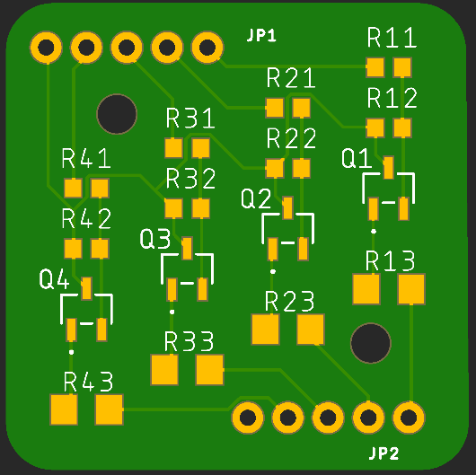
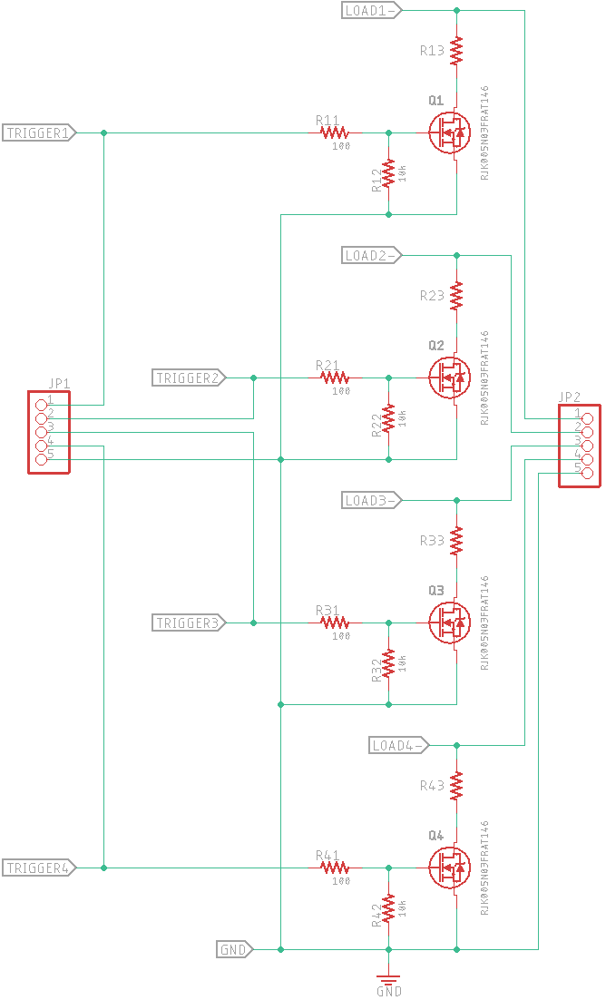

# GPIO Driver Module

## Introduction

This project provides (4) channels of GPIO triggered low-side switching to ground. This allows low current microcontrollers to control higher current devices like LEDs, Optocouplers, Relays, etc. You can use the higher power provided by the 5V USB pin rather than the more limited current provided by the on-board 3.3V regulator and GPIO circuitry.

Rx3 is a 0Ω jumper that can be replaced by a 1206-size dropping resistor limit the current through your device.

I will provide all of the files necessary to have these boards fabricated and populated with the small SMD components. Some number of panels will be produced and made available via Assistive Technology channels.

## Status

|    Date    | Status                                |
| :--------: | ------------------------------------- |
| 2022-11-16 | Initial release - unfabbed, untested. |

## ToDo List

* ~~Label the solder holes~~.
* ~~Document hole placement~~.

## Mechanical Info

The board is currently 29mm square with (2) M2 mounting holes. The header are 5-conductor, 0.1"/2.54mm pitch. Hole size = 0.076"/1.93mm. The dimensional drawing is [here](assets/dimensions.png).

The board's size could be reduced by moving circuitry for two channels to the other side of the board and moving the connectors so that they're symmetrical.

## Components

### MOSFET

An N-channel MOSFET provides low-side switching from the user's load to ground. 3V3 GPIO output voltage is provided to the MOSFET's gate which sinks ultra-low current. The MOSFET's Drain to Source resistance then drops below 1Ω, allowing current to flow from LOAD- through resistor Rx3 then the MOSFET (drain to source) to ground.

Key metrics:

| Parameter                    | Value      | Notes             |
| ---------------------------- | ---------- | ----------------- |
| Vdss Drain to Source Voltage | 30V MAX    |                   |
| Vgss Gate to Source Voltage  | +/-12V MAX |                   |
| Id - Drain current           | 500mA MAX  |                   |
| Pd - Power Dissipation       | 200mW MAX  |                   |
| Vgs_threshold                | 0.8-1.5V   | Vds=10V, Id=1mA   |
| Rds_on                       | 650mΩ typ. | Vgs=2.5, Id=500mA |

[Datasheet](https://media.digikey.com/pdf/Data%20Sheets/Rohm%20PDFs/RJK005N03FRA_DS.pdf)

### Resistors

Because of the MOSFET's gate capacitance, two resistors are required for each channel:

* **Rx1** - 100Ω current limiting resistor.
* **Rx2** - 100kΩ discharge resistor.

A 1206-size resistor pad at **Rx3** is fitted with a 0Ω jumper by default. If a current-limiting dropping resistor is required, replace the jumper.

## Parts List

| Location     | Part Number                                                  | Notes                                                   |
| ------------ | ------------------------------------------------------------ | ------------------------------------------------------- |
| MOSFET Qx    | Rohm [RJK005N03FRAT146](https://www.digikey.com/short/qvnjfq3w) 30 V 500mA 200mW | N-Channel 30 V 500mA (Ta) 200mW (Ta) Surface Mount SMT3 |
| Resistor Rx1 | Stackpole [RMCF0603JT100R](https://www.digikey.com/short/289f4vh8) 100Ω 5% 1/10W 0603 |                                                         |
| Resistor Rx2 | Stackpole [RMCF0603JT10K0](https://www.digikey.com/short/h7rn9qc7) 10kΩ 5% 1/10W 0603 |                                                         |
| Resistor Rx3 | Stackpole [RMCF1206ZT0R00](https://www.digikey.com/short/5hqtqvbn) 0Ω 1/4W 1206 Jumper | Replace with dropping resistor as needed.               |

## Jumper Pins

Solder pads are provided for 0.1" pitch jumpers or connectors.

### JP1

|   5    |     4     |     3     |     2     |     1     |
| :----: | :-------: | :-------: | :-------: | :-------: |
| Ground | Trigger 4 | Trigger 3 | Trigger 2 | Trigger 1 |

Connect your GPIO pin to the Trigger pin to connect your device to ground on an active high signal.

### JP2

|   5    |    4    |    3    |    2    |    1    |
| :----: | :-----: | :-----: | :-----: | :-----: |
| Ground | Load- 4 | Load- 3 | Load- 2 | Load- 1 |

Connect the cathode of your device to the LOAD- pin.

## Images

#### Board

#### Schematic

