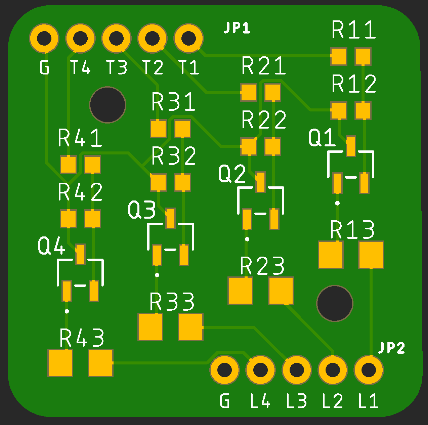
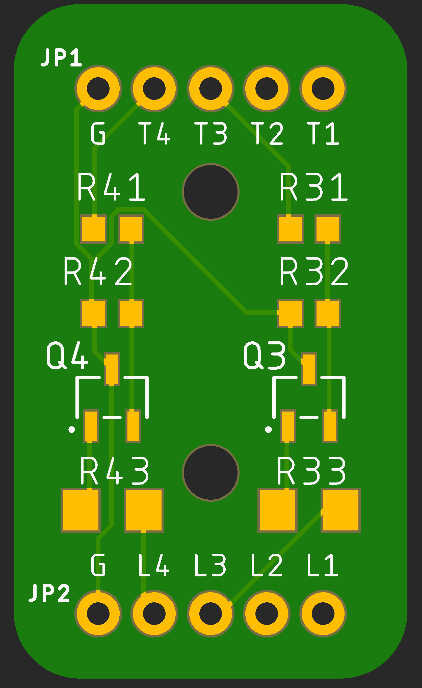
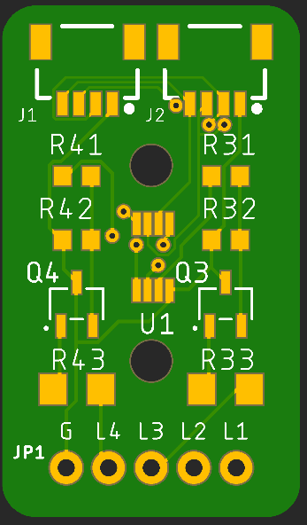
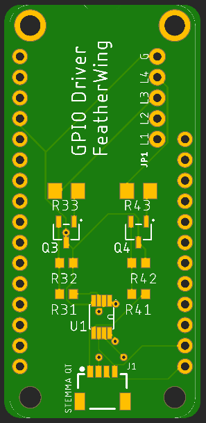

# GPIO Driver Module

## Introduction

This project provides (4) channels of GPIO triggered low-side switching to ground. This allows low current microcontrollers to control higher current devices like LEDs, Optocouplers, Relays, etc. You can use the higher power provided by the 5V USB pin rather than the more limited current provided by the on-board 3.3V regulator and GPIO circuitry.

Rx3 is a 0Ω jumper that can be replaced by a 1206-size dropping resistor limit the current through your device.

I will provide all of the files necessary to have these boards fabricated and populated with the small SMD components. Some number of panels will be produced and made available via Assisti4ve Technology channels.

## Status

|    Date    | Status                                |
| :--------: | ------------------------------------- |
| 2022-11-19 | Introducing variants                  |
| 2022-11-16 | Initial release - unfabbed, untested. |

## ToDo List

* Reset circuitry for the FeatherWing version.

## Variants

### Original

The Original was a quick effort related to another project to see if there was interest. Then the wheels started spinning.

### Skinny

The Skinny was a simple effort to clean up the Original board by moving half of the circuitry to the underside and centering the headers so everything was symetrical.

### QT

The QT was another variant to remove the need for the GPIO control lines from the MCU and instead make a Qwiic/STEMMA QT version with an I2C enabled I/O Expander. The Diodes Inc. PI4IOE5V9536 seems to fit the bill. Two Qwiic/STEMMA QT ports are provided for daisy-chaining. The Load header remains.

### Wing

Next came a request to fit the board to common board sizes. The (Feather) Wing was born.

### Variant Files

Details for each of the variants will appear in the README.md file in each of the board subdirectories.  Board directories will also include:

* Eagle PCB files including sch, brd, and zip file containing Gerber, centroid, and BOM files suitable for submission for board manufacturing and assembly.
* An importable Digi-Key Parts List.

## Options

I'm considering various options to give this board broader utility.

* Remove the gate pull-down resistor for a smaller board since most designs are low speed and the GPIO outputs are actively driven.
  * I may be able to do this unless the startup time required to drive the gate low is too great and we need a stronger pull-down.

* Use an I2C enabled port [expander](https://www.digikey.com/short/jd43pq03) to drive the gates. A Qwiic/STEMMA QT connector would eliminate the Trigger header and free up GPIO pins. Push-pull I/O preferred. ([D-K Search](https://www.digikey.com/short/ph7ww3hz)). **Done.**

## Mechanical Info

The board is currently 29mm square with (2) M2 mounting holes. The header are 5-conductor, 0.1"/2.54mm pitch. Hole size = 0.076"/1.93mm. The dimensional drawing is [here](assets/dimensions.png).

The board's size could be reduced by moving circuitry for two channels to the other side of the board and moving the connectors so that they're symmetrical. Or by removing the gate pull-down resistors, or even the voltage dropping resistors. Skinny board shown below. 18x30.5mm

## Components

### MOSFET

An N-channel MOSFET provides low-side switching from the user's load to ground. 3V3 GPIO output voltage is provided to the MOSFET's gate which sinks ultra-low current. The MOSFET's Drain to Source resistance then drops below 1Ω, allowing current to flow from LOAD- through resistor Rx3 then the MOSFET (drain to source) to ground.

Key metrics:

| Parameter                    | Value      | Notes             |
| ---------------------------- | ---------- | ----------------- |
| Vdss Drain to Source Voltage | 30V MAX    |                   |
| Vgss Gate to Source Voltage  | +/-12V MAX |                   |
| Id - Drain current           | 500mA MAX  |                   |
| Pd - Power Dissipation       | 200mW MAX  |                   |
| Vgs_threshold                | 0.8-1.5V   | Vds=10V, Id=1mA   |
| Rds_on                       | 650mΩ typ. | Vgs=2.5, Id=500mA |

[Datasheet](https://media.digikey.com/pdf/Data%20Sheets/Rohm%20PDFs/RJK005N03FRA_DS.pdf)

### Resistors

Because of the MOSFET's gate capacitance, two resistors are required for each channel:

* **Rx1** - 100Ω current limiting resistor.
* **Rx2** - 100kΩ discharge resistor.

A 1206-size resistor pad at **Rx3** is fitted with a 0Ω jumper by default. If a current-limiting dropping resistor is required, replace the jumper.

## Parts List

| Location     | Part Number                                                  | Notes                                                   |
| ------------ | ------------------------------------------------------------ | ------------------------------------------------------- |
| MOSFET Qx    | Rohm [RJK005N03FRAT146](https://www.digikey.com/short/qvnjfq3w) 30 V 500mA 200mW | N-Channel 30 V 500mA (Ta) 200mW (Ta) Surface Mount SMT3 |
| Resistor Rx1 | Stackpole [RMCF0603JT100R](https://www.digikey.com/short/289f4vh8) 100Ω 5% 1/10W 0603 |                                                         |
| Resistor Rx2 | Stackpole [RMCF0603JT10K0](https://www.digikey.com/short/h7rn9qc7) 10kΩ 5% 1/10W 0603 |                                                         |
| Resistor Rx3 | Stackpole [RMCF1206ZT0R00](https://www.digikey.com/short/5hqtqvbn) 0Ω 1/4W 1206 Jumper | Replace with dropping resistor as needed.               |

## Jumper Pins

Solder pads are provided for 0.1" pitch jumpers or connectors.

### JP1

|   5    |     4     |     3     |     2     |     1     |
| :----: | :-------: | :-------: | :-------: | :-------: |
| Ground | Trigger 4 | Trigger 3 | Trigger 2 | Trigger 1 |

Connect your GPIO pin to the Trigger pin to connect your device to ground on an active high signal.

### JP2

|   5    |    4    |    3    |    2    |    1    |
| :----: | :-----: | :-----: | :-----: | :-----: |
| Ground | Load- 4 | Load- 3 | Load- 2 | Load- 1 |

Connect the cathode of your device to the LOAD- pin.

## Images

#### Original

#### Skinny

#### QT

#### Wing

### Schematics

#### Original & Skinny

